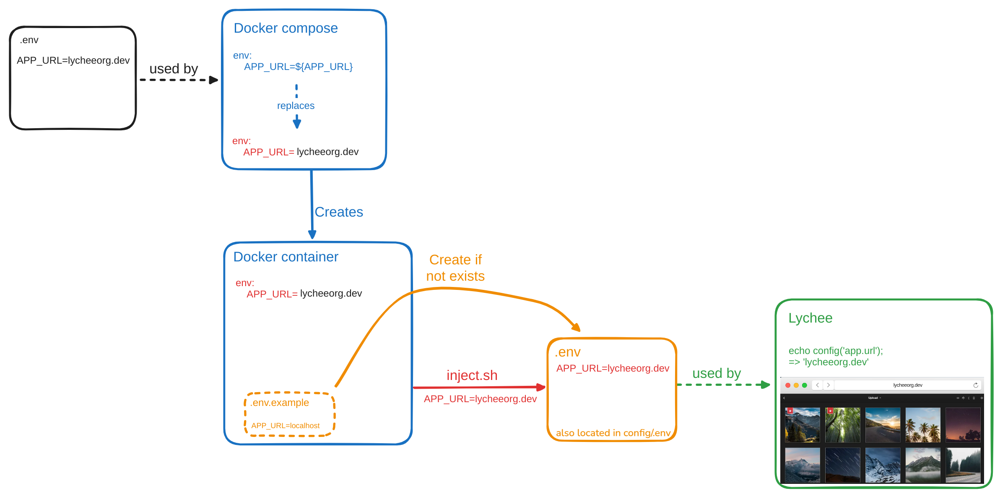

[![Build Status][build-status-shield]](https://github.com/LycheeOrg/Lychee-Docker/actions/workflows/nightly.yml)
[![Last Commit][last-commit-shield]](https://github.com/LycheeOrg/Lychee-Docker/commits/master)
[![Lychee Version][lychee-version-shield]](https://hub.docker.com/r/lycheeorg/lychee)
[![Docker Pulls (new)][docker-pulls-shield]](https://hub.docker.com/r/lycheeorg/lychee)
[![Docker Pulls (old)][docker-pulls-shield-old]](https://hub.docker.com/r/lycheeorg/lychee-laravel)
<br>
![Supports amd64 Architecture][amd64-shield]
![Supports arm64/aarch64 Architecture][arm64-shield]
![Supports armv7 Architecture][armv7-shield]

## Notice: Dockerhub repository has been migrated to [lycheeorg/lychee](https://hub.docker.com/r/lycheeorg/lychee)  
**Make sure you update your docker-compose files accordingly**

## Table of Contents
<!-- TOC depthFrom:1 depthTo:6 withLinks:1 updateOnSave:1 orderedList:0 -->
- [Notice: Dockerhub repository has been migrated to lycheeorg/lychee](#notice-dockerhub-repository-has-been-migrated-to-lycheeorglychee)
- [Table of Contents](#table-of-contents)
- [Image Content](#image-content)
- [Setup](#setup)
	- [Quick Start](#quick-start)
	- [Prerequisites](#prerequisites)
	- [Run with Docker](#run-with-docker)
	- [Run with Docker Compose](#run-with-docker-compose)
	- [Create admin account during first run](#create-admin-account-during-first-run)
	- [Docker secrets](#docker-secrets)
- [Available environment variables and defaults](#available-environment-variables-and-defaults)
<!-- /TOC -->

## Image Content

This image features Lychee, nginx and PHP-FPM. The provided configuration (PHP, nginx...) follows Lychee's official recommendations.

The following tags are available :

* `latest`: Latest Lychee release
* `v[NUMBER]`: Stable version tag for a Lychee release
* `nightly` (also `dev`): Current master branch tag (Lychee operates on a stable master, so this should usually be safe)
* `devtools`: As above, but includes development dependencies
* `testing`: Tag for testing new branches and pull requests. Designed for internal use by LycheeOrg
* `alpha`: Current alpha branch tag (The alpha branch contains bleeding edge changes that are not peer-reviewed)
* `alpha-devtools`: As above, but includes development dependencies

## Setup

### Quick Start

To use the built-in SQLite support, no external dependencies are required. At its simplest, `docker run -p 80 lycheeorg/lychee:dev` will start Lychee listening on a random port on the local host.

For more runtime options, look below in [Run with Docker](#run-with-docker) and [Available environment variables and defaults](#available-environment-variables-and-defaults).

### Prerequisites

To use this image with MySQL, MariaDB or PostgreSQL you will need a suitable database running externally. This may be through a Docker image, possibly in your `docker-compose.yml`.

1.  Create the db, username, password.
2.  Edit the environment variables (db credentials, language...) by :
    *  Supplying the environment variables via `docker run` / `docker-compose` **or**
    *  Creating a `.env` file with the appropriate info and mount it to `/conf/.env` **or**
    *  Use the Lychee installer by passing `-e DB_CONNECTION=` on the command line and connecting to the container with your browser

### Run with Docker

**Make sure that you link to the container running your database !!**  

The example below shows `--net` and `--link` for these purposes. `--net` connects to the name of the network your database is on and `--link` connects to the database container.

```bash
docker run -d \
--name=lychee \
-v /host_path/lychee/conf:/conf \
-v /host_path/lychee/uploads:/uploads \
-v /host_path/lychee/sym:/sym \
-e PUID=1000 \
-e PGID=1000 \
-e PHP_TZ=America/New_York \
-e TIMEZONE=America/New_York \
-e DB_CONNECTION=mysql \
-e DB_HOST=mariadb \
-e DB_PORT=3306 \
-e DB_DATABASE=lychee \
-e DB_USERNAME=user \
-e DB_PASSWORD=password \
-p 90:80 \
--net network_name \
--link db_name \
lycheeorg/lychee
```

**Warning** : if you use a MySQL database, make sure to use the `mysql_native_password` authentication plugin, either by using the `--default-authentication-plugin` option when starting mysql, or by running a query to enable the authentication plugin for the `lychee` user, e.g. :

```
alter user 'lychee' identified with mysql_native_password by '<your password>';
```

### Run with Docker Compose

You can take the provided docker-compose.yml example as a start and edit it to enable more configuration variables.

Use the `.env.exanple` to create a `.env` at the root of your folder containing your `docker-compose.yml`.
Populate your database credentials and other environment variables.

This `.env` file will be loaded by docker compose and populate environment in the docker container.
Those will then be injected in the Lychee configuration file (located in e.g. `lychee/config/.env`).



:warning: If you later edit your `lychee/config/.env` file, restarting the container will overwrite those variables with the ones provided in your docker-compose `.env` file.
For this reason it is better to make your changes directly in `docker-compose.yml`/`.env` rather than in `lychee/config/.env` when the values are supported.
Please refer to the [inject.sh](https://github.com/LycheeOrg/Lychee/blob/master/inject.sh) script for more details.

### Create admin account during first run

When ADMIN_USER and ADMIN_PASSWORD (or ADMIN_PASSWORD_FILE) are set an admin user will be created with those credentials during the first run. Otherwise Lychee will prompt in the browser when first loaded.

### Docker secrets

As an alternative to passing sensitive information via environment variables, _FILE may be appended to some of the environment variables, causing the initialization script to load the values for those variables from files present in the container. In particular, this can be used to load passwords from Docker secrets stored in /run/secrets/<secret_name> files.

If both the original variable and the _FILE (e.g. both DB_PASSWORD and DB_PASSWORD_FILE) are set, the original variable will be used.

The following _FILE variables are supported:

* DB_PASSWORD_FILE
* REDIS_PASSWORD_FILE 
* MAIL_PASSWORD_FILE
* ADMIN_PASSWORD_FILE

## Available environment variables and defaults

If you do not provide environment variables or `.env` file, the [example .env file](https://github.com/LycheeOrg/Lychee/blob/master/.env.example) will be used with some values already set by default inside the docker container.

Some variables are specific to Docker, and the default values are :

* `PUID=1000`
* `PGID=1000`
* `USER=lychee`
* `PHP_TZ=UTC`
* `STARTUP_DELAY=0`

Additionally, if `SKIP_PERMISSIONS_CHECKS` is set to "yes", the entrypoint script will not check or set the permissions of files and directories on startup. Users are strongly advised **against** using this option, and efforts have been made to keep the checks as fast as possible. Nonetheless, it may be suitable for some advanced use cases.

[arm64-shield]: https://img.shields.io/badge/arm64-yes-success.svg?style=flat
[amd64-shield]: https://img.shields.io/badge/amd64-yes-success.svg?style=flat
[armv7-shield]: https://img.shields.io/badge/armv7-yes-success.svg?style=flat
[build-status-shield]: https://img.shields.io/github/actions/workflow/status/LycheeOrg/Lychee-Docker/nightly.yml?label=nightly
[docker-pulls-shield-old]: https://img.shields.io/docker/pulls/lycheeorg/lychee-laravel.svg?style=flat&label=Docker%20Pulls%20(lychee-laravel)
[docker-pulls-shield]: https://img.shields.io/docker/pulls/lycheeorg/lychee.svg?style=flat&label=Docker%20Pulls%20(lychee)
[lychee-version-shield]: https://img.shields.io/docker/v/lycheeorg/lychee/latest?style=flat&label=Lychee%20Version%20(:latest)
[last-commit-shield]: https://img.shields.io/github/last-commit/LycheeOrg/Lychee-Docker.svg?style=flat
